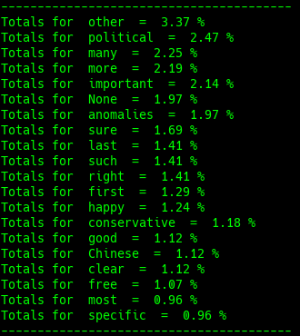

# ADJ

## Definition

"In [linguistics](https://en.wikipedia.org/wiki/Linguistics), an **adjective** \([abbreviated](https://en.wikipedia.org/wiki/List_of_glossing_abbreviations) **adj**\) is a describing word, the main [syntactic](https://en.wikipedia.org/wiki/Syntax) role of which is to [qualify](https://en.wikipedia.org/wiki/Grammatical_modifier) a [noun](https://en.wikipedia.org/wiki/Noun) or [noun phrase](https://en.wikipedia.org/wiki/Noun_phrase), giving more information about the object signified.[\[1\]](https://en.wikipedia.org/wiki/Adjective#cite_note-1)" - [Wikipedia](https://en.wikipedia.org/wiki/Adjective)

## Example

