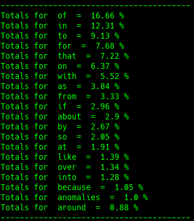

# ADP

## Definition

"**Prepositions** and **postpositions**, together called **adpositions** \(or broadly, in English, simply **prepositions**\),[\[1\]](https://en.wikipedia.org/wiki/Preposition_and_postposition#cite_note-HP602-1) are a [class of words](https://en.wikipedia.org/wiki/Part_of_speech) used to express spatial or temporal relations \(in, under, towards, before\) or mark various [semantic roles](https://en.wikipedia.org/wiki/Thematic_relations) \(of, for\).[\[2\]](https://en.wikipedia.org/wiki/Preposition_and_postposition#cite_note-2)

A preposition or postposition typically combines with a [noun](https://en.wikipedia.org/wiki/Noun) or [pronoun](https://en.wikipedia.org/wiki/Pronoun), or more generally a [noun phrase](https://en.wikipedia.org/wiki/Noun_phrase), this being called its [complement](https://en.wikipedia.org/wiki/Complement_%28grammar%29), or sometimes [object](https://en.wikipedia.org/wiki/Object_%28grammar%29). A preposition comes before its complement; a postposition comes after its complement. English generally has prepositions rather than postpositions – words such as in, under and of precede their objects, such as in England, under the table, of Jane – although there are a few exceptions including "ago" and "notwithstanding", as in "three days ago" and "financial limitations notwithstanding". Some languages that use a different word order, have postpositions instead, or have both types. The [phrase](https://en.wikipedia.org/wiki/Phrase) formed by a preposition or postposition together with its complement is called a [prepositional phrase](https://en.wikipedia.org/wiki/Prepositional_phrase) \(or postpositional phrase, adpositional phrase, etc.\) – such phrases usually play an [adverbial](https://en.wikipedia.org/wiki/Adverbial) role in a sentence." - [Wikipedia](https://en.wikipedia.org/wiki/Preposition_and_postposition)

## Example

