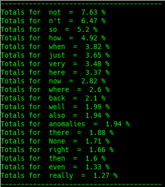

# ADV

## Definition

"An **adverb** is a word that [modifies](https://en.wikipedia.org/wiki/Modifier_%28grammar%29) a [verb](https://en.wikipedia.org/wiki/Verb), [adjective](https://en.wikipedia.org/wiki/Adjective), [determiner](https://en.wikipedia.org/wiki/Determiner), [clause](https://en.wikipedia.org/wiki/Clause), preposition, or [sentence](https://en.wikipedia.org/wiki/Sentence_%28linguistics%29). Adverbs typically express manner, place, time, frequency, degree, level of certainty, etc., answering questions such as how?, in what way?, when?, where?, and to what extent?. This function is called the [adverbial](https://en.wikipedia.org/wiki/Adverbial) function, and may be realized by single words \(adverbs\) or by multi-word expressions \([adverbial phrases](https://en.wikipedia.org/wiki/Adverbial_phrase) and [adverbial clauses](https://en.wikipedia.org/wiki/Adverbial_clause)\)." - [Wikipedia](https://en.wikipedia.org/wiki/Adverb)

## Example

