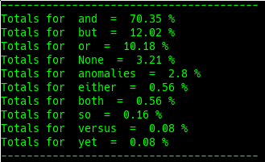

# CONJ

## Definition

"In [grammar](https://en.wikipedia.org/wiki/Grammar), a **conjunction** \([abbreviated](https://en.wikipedia.org/wiki/List_of_glossing_abbreviations) **conj** or **cnj**\) is a [part of speech](https://en.wikipedia.org/wiki/Part_of_speech) that connects [words](https://en.wikipedia.org/wiki/Words), [phrases](https://en.wikipedia.org/wiki/Phrase), or [clauses](https://en.wikipedia.org/wiki/Clause) that are called the [conjuncts](https://en.wikipedia.org/wiki/Conjunct) of the conjoining construction. The term [discourse marker](https://en.wikipedia.org/wiki/Discourse_marker) is mostly used for conjunctions joining [sentences](https://en.wikipedia.org/wiki/Sentences). This definition may overlap with that of other parts of speech, so what constitutes a "conjunction" must be defined for each [language](https://en.wikipedia.org/wiki/Language). In English a given word may have several [senses](https://en.wikipedia.org/wiki/Word_sense), being either a [preposition](https://en.wikipedia.org/wiki/Preposition) or a conjunction depending on the syntax of the sentence \(for example, "after" being a preposition in "he left after the fight" versus it being a conjunction in "he left after they fought"\). In general, a conjunction is an invariable \(non[inflected](https://en.wikipedia.org/wiki/Inflection)\) [grammatical particle](https://en.wikipedia.org/wiki/Grammatical_particle) and it may or may not stand between the items conjoined.

The definition may also be extended to idiomatic phrases that behave as a unit with the same function, e.g. "as well as", "provided that".

A simple literary example of a conjunction: "the truth of nature, and the power of giving interest". \(Samuel Taylor Coleridge's Biographia Literaria\)[\[1\]](https://en.wikipedia.org/wiki/Conjunction_%28grammar%29#cite_note-1)

Conjunctions may be placed at the beginning of sentences:[\[2\]](https://en.wikipedia.org/wiki/Conjunction_%28grammar%29#cite_note-2) "But some superstition about the practice persists".[\[3\]](https://en.wikipedia.org/wiki/Conjunction_%28grammar%29#cite_note-3)" - [Wikipedia](https://en.wikipedia.org/wiki/Conjunction_%28grammar%29)

## Example

