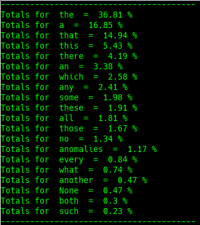

# DET

## Definition

"A **determiner**, also called **determinative** \([abbreviated](https://en.wikipedia.org/wiki/List_of_glossing_abbreviations) **det**\), is a [word](https://en.wikipedia.org/wiki/Word), [phrase](https://en.wikipedia.org/wiki/Phrase), or [affix](https://en.wikipedia.org/wiki/Affix) that occurs together with a [noun](https://en.wikipedia.org/wiki/Noun) or [noun phrase](https://en.wikipedia.org/wiki/Noun_phrase) and serves to express the [reference](https://en.wikipedia.org/wiki/Reference) of that noun or noun phrase in the context. That is, a determiner may indicate whether the noun is referring to a definite or indefinite element of a class, to a closer or more distant element, to an element belonging to a specified person or thing, to a particular number or quantity, etc. Common kinds of determiners include definite and indefinite [articles](https://en.wikipedia.org/wiki/Article_%28grammar%29) \(like the English the and a or an\), [demonstratives](https://en.wikipedia.org/wiki/Demonstrative) \(this and that\), [possessive determiners](https://en.wikipedia.org/wiki/Possessive_determiner) \(my and their\), [quantifiers](https://en.wikipedia.org/wiki/Quantifier_%28linguistics%29) \(many, few and several\), [numerals](https://en.wikipedia.org/wiki/Numeral_%28linguistics%29), [distributive](https://en.wikipedia.org/wiki/Distributive_%28linguistics%29) determiners \(each, any\), and [interrogative](https://en.wikipedia.org/wiki/Interrogative_word) determiners \(which\)." - [Wikipedia](https://en.wikipedia.org/wiki/Determiner)

## Example

