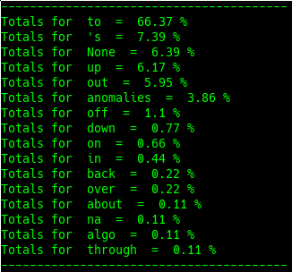

# PRT

## Definition

"In [grammar](https://en.wikipedia.org/wiki/Grammar) the term **particle** \([abbreviated](https://en.wikipedia.org/wiki/List_of_glossing_abbreviations) **ptcl**\) has a traditional meaning, as a [part of speech](https://en.wikipedia.org/wiki/Part_of_speech) that cannot be [inflected](https://en.wikipedia.org/wiki/Inflection), and a modern meaning, as a [function word](https://en.wikipedia.org/wiki/Function_word) associated with another word or phrase to impart meaning." - [Wikipedia](https://en.wikipedia.org/wiki/Grammatical_particle)

## Example

